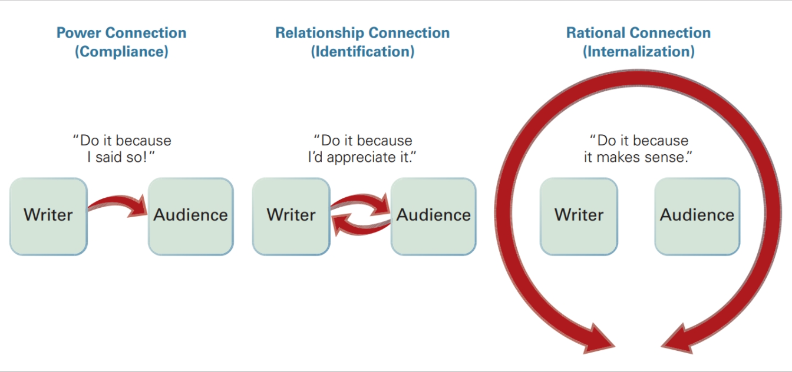
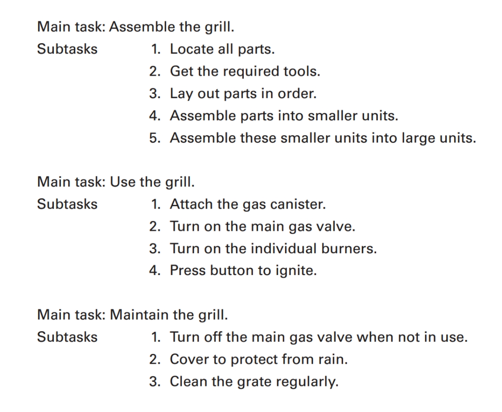

# Providing Audiences with Usable Information

A document's *usability* is a measure of how well that document fulfills the information
needs of its audience. Whatever their specific goals and concerns in using a particular
document, readers must be able to do at least three things:

- Locate the information they need easily.
- Understand the information immediately.
- Use the information safely and successfully.

To assess the usability of a manual that comes with your new gas grill, for instance, you
would ask: “How well do these instructions enable me to assemble, operate, and main-
tain the grill safely and effectively?” To prepare a usable document, follow these six steps:

1. Analyze the document’s audience.
2. Determine the document’s purpose.
3. Create a task analysis for the document.
4. Consider the setting, potential problems, length, format, timing, and budget.
5. Develop an information plan for the document.
6. Write, test, and revise the document.

## Analyze the Document's Audience

You cannot create an effective document until you first explore all you can about who will
use your document. In other words, understand your audience. Ask these questions:

- Who is the main audience for this document?
- Who else is likely to read it?
- What is your relationship with the audience? Are there multiple types of relationships involved?
- How familiar might the audience be with technical details?
- What culture or cultures does your audience represent?
- What media format (printed manual; PDF available online; interactive Web page) is best for this audience?

### Primary and Secondary Audiences

When writing technical documents, keep two audiences in mind. Most documents are geared to an immediate audience. This is your *primary audience*. But most documents also have a *secondary audience*- those outside the immediate circle of people who will be needing information directly.

### Relationship with Audience

Determining the answer to this question will help you determine the formality of your document. Do you know the readers personally? Are they likely to welcome or reject your information? Are they a combination of people at various levels?

### Audience's Technical Background

Any message can be conveyed in numerous ways, depending on how it is written and designed for different audiences. The broader the audience, the more you must consider the various levels of expertise and language usage. 

### Audience’s Cultural Background

Information needs and preferences often are culturally determined. Although it is not possible to generalize about an entire group of people from a particular culture or country, international communication experts have noted some characteristics can be helpful.

- German audiences, for example, often value thoroughness and complexity with detail included and explained in a businesslike tone.
- Japanese audiences generally prefer multiple perspectives on the material, plenty of graphics, and a friendly, encouraging tone (Hein 125-26).
- Western business culture generally values plain talk that gets right to the point, but Eastern cultures may consider this rude, preferring indirect, more ambiguous messages that leave interpretation up to the reader.

The more you can learn about your specific readers for your specific document or information, the more you can consider how cultural differences might create misunderstanding in your situation and seek an approach that bridges these differences.

### strategies for Analyzing Your Audience {-}

- **Picture your readers and exactly what they need and expect.** Whether your audience is the company president or the person next to you in class, that person has specific concerns and information needs. Your readers may need to complete a task, solve a problem, make a decision, evaluate your performance, or take a stand on an issue.
- **Identify the primary and secondary audiences, your relationship to them, and their technical and cultural background.** Remember that if your document will be widely available via the Internet, you may need to add an explicit audience statement (“this material is written for the following audiences...”) and/or provide links that direct people of different technical backgrounds to information suited for their background and needs.
- **When you don’t know exactly who will be reading your document, picture the “general reader.”** General readers are impatient with abstract theories yet expect enough background to help them grasp your message. They are bored or confused by excessive detail and frustrated by raw facts left unexplained or not interpreted. Instead of trying to show readers how smart you are, make them feel smart. Whoever they are, readers need enough material to understand your position and to react appropriately.
- **Anticipate readers’ questions.** Based on their needs and concerns, readers have questions: What is it? What does it mean? What happened? Who was involved? When, where, and why did it happen? What might happen? How do | do it? How did you do it? Why is X better than Y? Can you give examples? Says who? So what? Give readers what they need to know.
- **Recognize that audiences are not merely passive recipients of information.** Technical communicators and their audiences should overlap and interact. Therefore, as you analyze and learn about your audience, remember that the communication process works both ways, especially in online settings where readers are invited to leave feedback and ask questions. Use this information to refine and update your document based on what you learn from these readers.

## Determine the Document's Purpose

To create an effective technical document you need to understand how readers will use it. In other words, determine your purpose. Ask these questions:

- What is the main purpose of the document?
- What other purpose or purposes does the document serve?
- What will readers do with this information?

### Primary and Secondary Purposes

All forms of technical communication are intended to fulfill a specific primary purpose. As discussed in Chapter 1, the primary purpose (to inform, to instruct, or to persuade) will affect the document’s overall shape and substance.

Many documents have a primary purpose and one or more secondary purposes. For example, the primary purpose in most instruction manuals is to instruct; that is, to teach an audience how to assemble or use the product. But for ethical and legal reasons, companies also want people to use the product safely. A manual for a power tool or a lawnmower, for instance, typically begins with a page that spells out safety hazards before instructing readers how to assemble and use the mechanism.

In planning a document, work from a clear statement of purpose that takes into account both the primary and secondary purposes. For example, “The purpose of my document is to inform my readers of the new absentee policy and to instruct them on how to follow the procedures properly,” or “The purpose of my document is to inform my readers about the new antivirus software as well as to instruct them on how to install the software and to persuade them of the importance of running weekly virus scans.”

### Intended Use of the Document

In addition to determining purposes of a document from your own perspective, also consider how and why it will be used by others. Answer a variety of questions: Do my readers simply want to learn facts or understand concepts? Will they use my information in making some decision? Will people act immediately on the information? Do they need step-by-step instructions? In my audience’s view, what is most important about this document? How and where will they use the document (outdoors while trying to assemble a new gas grill or tool shed? On their computer or phone as a PDF document while trying to fix a flat tire or install new software?) In addition to asking yourself these questions, try asking members of your audience directly, so you can verify what they want to know and where and how they will use the document.

## Know How to Be Persuasive

In the workplace, we rely on persuasion daily: to win coworker support, to attract clients and customers, to request funding. An email, a memo, a product description, or a set of instructions can be an implicitly persuasive document. Even the most complex report, which at first glance may appear to be “all facts,” can be persuasive because the writer probably shaped the report to favor a particular interpretation of the data.

Changing someone’s mind is never easy—in fact, sometimes it is impossible. Your success will depend on what you are requesting, who you are trying to persuade, and how entrenched those people are in their own views.

### Using Claims as a Basis for Persuasion
Explicit persuasion is required whenever you tackle an issue about which people disagree. Assume, for example, that you are Manager of Employee Relations at Softbyte, a software developer whose recent sales have plunged. To avoid layoffs, the company is trying to persuade employees to accept a temporary cut in salary. As you plan your various memos and presentations on this volatile issue, you must first identify your major claim or claims (a claim is a statement of the point you are trying to prove).

For example, in the Softbyte case, you might first want employees to recognize and acknowledge facts about which they may have been unaware or have ignored:

> Because of the global recession, our software sales in two recent quarters have fallen nearly 30 percent, and earnings should remain flat all year.

Even when a fact is obvious, people often disagree about what it means or what should be done about it. And so you might want to influence their interpretation of the facts:

> Reduced earnings mean temporary layoffs for roughly 25 percent of our staff. But we could avoid layoffs entirely if each of us at Softbyte would accept a 10 percent salary cut until the market improves.

And eventually you might want to ask for direct action:

> Our labor contract stipulates that such an across-the-board salary cut would require a two-thirds majority vote. Once you’ve had time to examine the facts, we hope you'll vote “yes” on next Tuesday's ballot.

### Connecting with Your Audience

Determine how best to connect with your audience. Persuasive people know when to simply declare what they want (get the reader to comply with what you say), when to reach out and create a relationship (get the reader to identify with what you say), when to appeal to reason and common sense (get the reader to internalize what you say), and when to employ some combination of these approaches.

## Create a Task Analysis for the Document

Most technical documents entail a series of tasks to be completed, tasks most evident in a set of instructions: If people want to change an oil filter, assemble a new gas grill, or install a new project management app, they must follow a step-by-step procedure. Less obvious is that other documents, such as reports, memos, and brochures.

## Consider Other Related Usability Factors

Once you’ve answered questions about audience (Who?), purpose (Why?), and tasks (How?), it’s time to consider smaller but no less important factors that influence the usability of your document: setting (Where?), potential problems (What are the hazards?), length (How much information?), format (Print? PDF? Interactive Web page or app?), timing (When?), and budget (How much money?).

### Setting

Will distractions or interruptions make it hard for people to pay attention? Will readers always have the document in front of them? Will they be scanning the document, studying it, or memorizing it? Will they read page by page or consult the document randomly?

### Potential Problems

How might the document be misinterpreted or misunderstood? Are there potential “trouble spots” (material too complex for this audience, hard to follow, or packed with information)? Are any important points missing? Anticipating problems is important in creating any technical document but especially in a set of instructions; therefore, when preparing instructions plan on background research. In planning the gas grill instruction manual, for example, learn all you can about the typical audience for this information (age, education, and so on). If possible, observe first-time operators using the instructions for a previous model and then ask for their feedback. Also, find out how most injuries occur, check company records for customer complaints, get feedback from dealers, and ask your legal department about prior injury claims by customers.

### Length

How much information is enough? This depends on what you can learn about your audience’s needs. Were you asked to “keep it short” or to “be comprehensive”? Are people more interested in conclusions and recommendations, or do they want everything spelled out? If you can observe people using draft versions of your document, you will quickly be able to see when a section is too long versus when you have not included enough information.

### Format

Does your audience expect a letter, a memo, a short report, or a long, formal report with supplements (title page, table of contents, appendices, and so on—see pages 294-306)? Can visuals and page layout (charts, graphs, drawings, headings, lists) make the material more accessible? Should the document be made available only in PDF format, online, where readers can make print copies if they wish? Or is there a legal or other reason why you need to include a print copy?

### Timing

Does your document have a deadline? Workplace documents almost always do. Is there a best time to submit it? Do you need to break down the deadline into a schedule of milestones? Will any of your information become outdated if you wait too long to complete the document?

### Budget

Does your document have a budget? If so, how much? Where can you save money? How much time can your company afford to allot you for creating the document? How much money can you spend obtaining permission to use materials from other sources? How much can you spend on printing, binding, and distributing your document? How much of the budget is dedicated to creating digital documents or a Web site or app to go along with (or take the place of) the document?

## Write, Test, Revise, and Proofread the Document

Ask respondents to: 

- **Content.** Are there any inaccuracies? Is the level of technicality appropriate to this audience? Are claims, conclusions, or recommendations supported by evidence? Are all key terms defined? Is the material free of gaps, foggy areas, or needless details?
- **Organization.** Is the structure of the document visible at a glance? Is anything out of order or hard to find or follow? Is the material “chunked” into easily digestible parts? Is the material organized in a logical sequence?
- **Style.** Is anything hard to understand, imprecise, too complex, or too wordy? Are sentences put together with enough variety? Is the tone appropriate for the situation? Are words chosen for exactness, not for camouflage?
- **Layout and visuals.** Are there adequate aids to navigation (heads, numbered lists, bullets, type styles)? Are there any excessively long paragraphs, lists, or steps? Are any visuals overly complex or misleading? Could anything be clarified by a visual? Is anything cramped and hard to read?
- **Ethical, legal, and cultural considerations.** Is there any distortion or misrepresentation of facts? Are there any potential legal or safety concerns?

Proofreading:

- Sentence errors, such as fragments, comma splices, or run-ons
- Punctuation errors, such as missing apostrophes or excessive commas
- Usage errors, such as “it’s” for “its”; “lay” for “lie”; or “their” for “there”
- Mechanical errors, such as misspelled words, inaccurate dates, or incorrect abbreviations
- Formatting errors, such as missing page numbers, inconsistent spacing, or incorrect form of documenting sources
- Typographical errors (typos), such as repeated or missing words or letters, missing word endings (say, -s or -ed or -ing), or an omitted quotation mark
