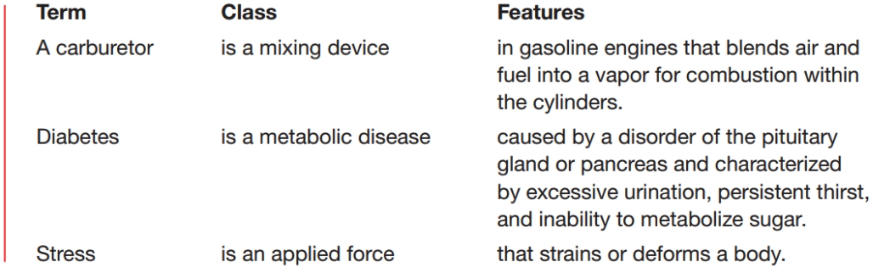
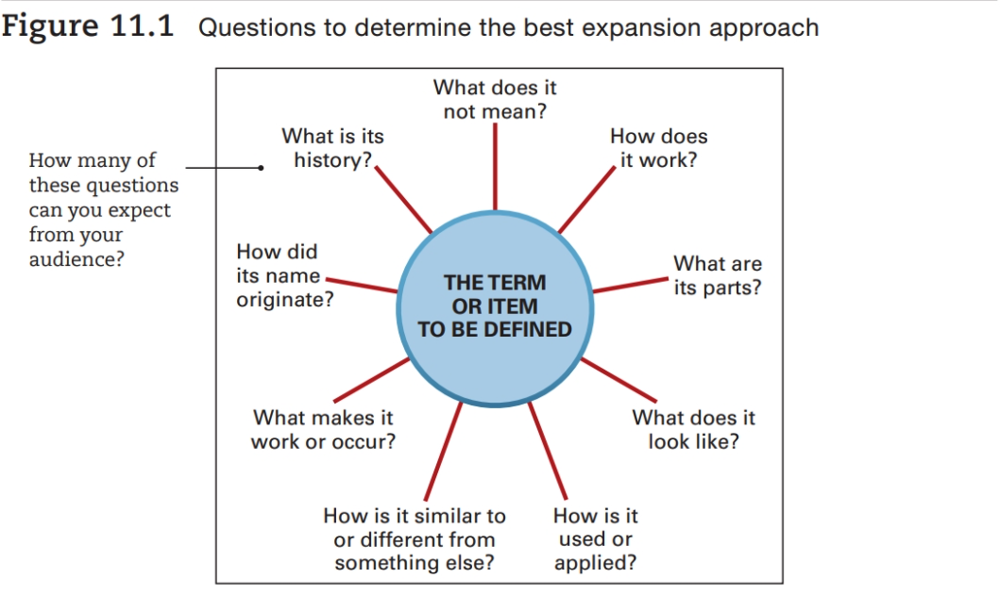
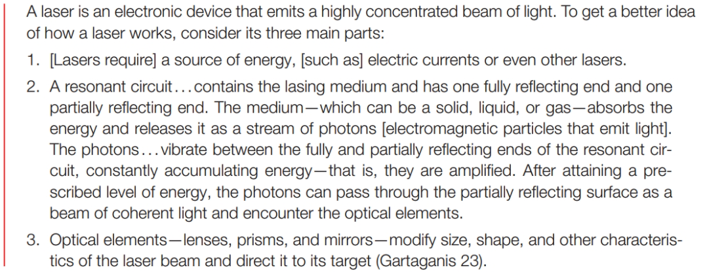
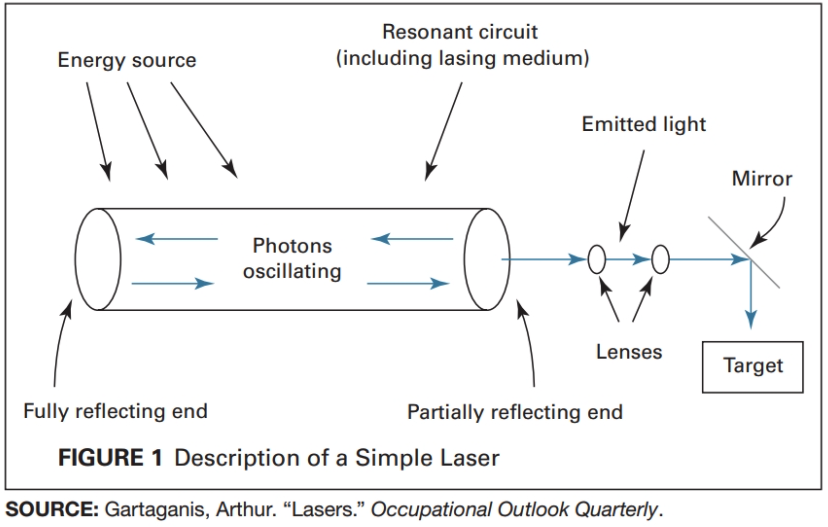

# Definitions

Definitions explain specialized terms or concepts and may be unfamiliar to people who don't have expertise in a particular field. In many cases, a term may have more than one meaning or different meanings in different fields.

## Audience and Purpose of Definitions

Definitions make a documents usable for an audience by answering one of two questions:

1. "What, exactly, does this definition entail?"
    - How the audience are affected by the item defined.
2. "What, exactly, is the process, item, concept, or technique?"
    - What makes an item, concept, or process unique.
    
Unless you are certain your audience will grasp the exact meaning, always define a term the first time you use it.

## Legal, Safety, and Societal Implications of Definitions

- Legal implications of definitions can be seen in documents such as contracts, which are detailed, legally binding definitions of the specific terms of an agreement.
- Safety implications. From areas such as food safety

## Types of Definitions

There are three distinct categories: `parenthetical`, `sentence`, and `expanded` definitions.

### Parenthetical Definitions

Often, you can clarify the meaning of a word by using a more familiar synonym or a clarifying phrase in parentheses immediately after the word.

> The leaching field (sieve-like drainage area) requires a crushed stone.

> The trees on the site are mostly deciduous (shedding foliage at season's end)

On a Web page of online help system, parenthetical definitions can be linked to the main word or phrase rather than in parentheses after the word.

In a print document, word or phrases are often defined in a separate list of defined items, known as a `glossary`.

### Sentence Definitions

A slightly longer way to define a phrase is to use the "term-class-features" method to form a sentence definition. 

1. Begin by stating the term
2. Indicate the broader class to which items belong
3. Followed by the features the distinguish it from other items in the general grouping

**Use a sentence definition when a concept requires further elaboration than a parenthetical definition could offer.**

Sentence definitions are especially useful if you plan to use a term frequently and need to establish a working definition that you will not need to repeat throughout the document:

> Throughout this report, the term disadvantaged student will refer to all students who lack adequate funds to pay for on-campus housing, food services, and medical care, but who are able to pay for their coursework and books through scholarships and part-time work.

### Expanded Definitions

A document that requires more detail or a highly complex term would call for an expanded definition. An expanded definition may be a short paragraph or may extend to several pages. 

## Methods for Expanding Definitions

The methods you decide to use will depend on the questions you expect the audience will want to be answered:

### Etymology

Sometimes, a word's origin (its development and changing meanings), can help clarify its meaning. For example, `biometrics` (the statistical analysis of biological data) is a word derived from the Greek `bio`, meaning life, and `metron`, meaning measure.

### History 

In some cases, the history of a term, concept, or procedure can be useful in expanding a definition. You might expand the definition of a laser by describing how the laser was invented: 

> The early researchers in fiber optic communications were hampered by two principal difficulties —
the lack of a sufficiently intense source of light and the absence of a medium which could transmit
this light free from interference and with a minimum signal loss. Lasers emit a narrow beam of
intense light, so their invention in 1960 solved the first problem. The development of a means
to convey this signal was longer in coming, but scientists succeeded in developing the first
communications-grade optical fiber of almost pure silica glass in 1970 (Stanton 28).

### Negation

Some definitions can be clarified by explaining what the term `does not` mean. For example, the following definition of a laser eliminates any misconceptions an audience might already have about lasers:

> A laser is an electronic device that emits a highly concentrated beam of light. It is used for many beneficial purposes (including corrective eye and other surgeries), not—as science fiction might tell you—as a transport medium to other dimensions.

### Operating Principle

The following example not only defines what a laser is but also shows the operating principle behind it:

> Basically, a laser [uses electrical energy to produce] coherent light: light in which all the waves are
in phase with each other, making the light hotter and more intense (Gartaganis 23).

### Analysis of Parts

Be sure to list all of the parts to create a complete picture, and, if necessary, define the individual parts as well, as in the following expanded definition of a laser:

### Visuals

Make sure any visual you use is labeled clearly. Always introduce and explain your visual and place the visual near your discussion. If the visual is borrowed, credit the source. The following visual accompanies the previous analysis of parts:

### Comparison and Contrast

By comparing (showing similarities) or by contrasting (showing differences) between new information and information your audience already understands, you help build a bridge between what people already know and what they don't.

## Placement of Definitions

Each time readers encounter an unfamiliar term or concept, that item should be defined in the same area on the page or screen. In a printed text, you can place a brief definitions in parentheses or in the document's margin, aligned with the terms being defined.

For longer reports, you can create a glossary. Glossaries are placed at the beginning or the end of a document, depending on organizational preferences.

Sentence definitions should be part of the running text. 

Place an expanded definition either near the beginning of a long document or in an appendix.

On a Web site, hyperlinks are a great way to make expanded definitions accessible because readers can click on an item, read about it, and then return to the original page.

## Strategies for Definitions

- **Decide on the level of detail you need.** Definitions vary greatly in length and detail, from a few words in parentheses to a multipage document. How much does this audience need in order to follow your explanation or grasp your point?
- **Classify the item precisely.** The narrower your class, the clearer your meaning. Stress is classified as an applied force; to say that stress “is what...” or “takes place when...” fails to denote a specific classification. Diabetes is precisely classified as a metabolic disease, not as a medical term.
- **Differentiate the item accurately.** If the distinguishing features are too broad, they will apply to more than this one item. A definition of brief as a “legal document used in court” fails to differentiate briefs from all other legal documents (wills, affidavits, and the like).
- **Avoid circular definitions.** Do not repeat, as part of the distinguishing feature, the word you are defining. “Stress is an applied force that places stress on a body” is a circular definition.
- **Expand your definition selectively.** Begin with a sentence definition and select the best expansion strategy or combination of expansion strategies for your audience and purpose.
- **Use visuals to clarify your meaning.** No matter how clearly you explain, as the saying goes, a picture can be worth a thousand words—even more so when used with readable, accurate writing.
- **Know “how much is enough.”** Don't insult people’s intelligence by giving needless details or spelling out the obvious.
- **Consider the legal implications of your definition.** What does an unsatisfactory job performance mean in an evaluation of a company employee: that the employee could be fired, required to attend a training program, or given one or more chances to improve (Performance Appraisal 3-4)? Failure to spell out your meaning invites a lawsuit.
- **Consider the safety implications of your definition.** Be sure your definition of a fuzzy or ambiguous term such as safe levels of exposure, conservative investment, or acceptable risk is based on fair and accurate interpretation of the facts and makes clear to readers the safety implications for them and their families.
- **Place your definition in an appropriate location.** Allow readers to access the definition and then return to the main text with as little disruption as possible. You might use a glossary, or, for an online document, you might consider hyperlinks that define the terms or ideas but keep readers on the same document page.
- **Cite your sources, as needed.** See Appendix A.

