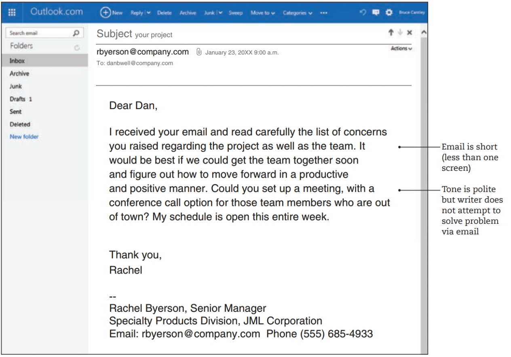
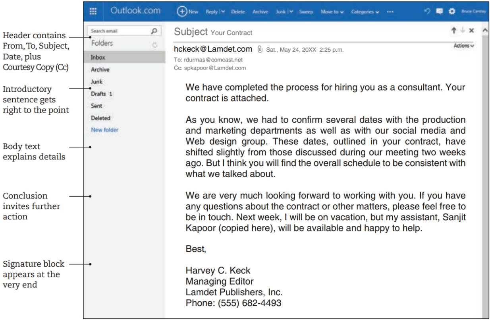
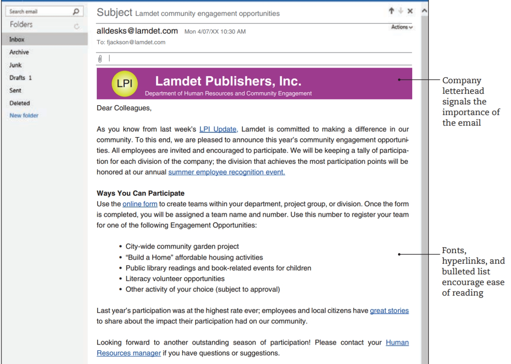
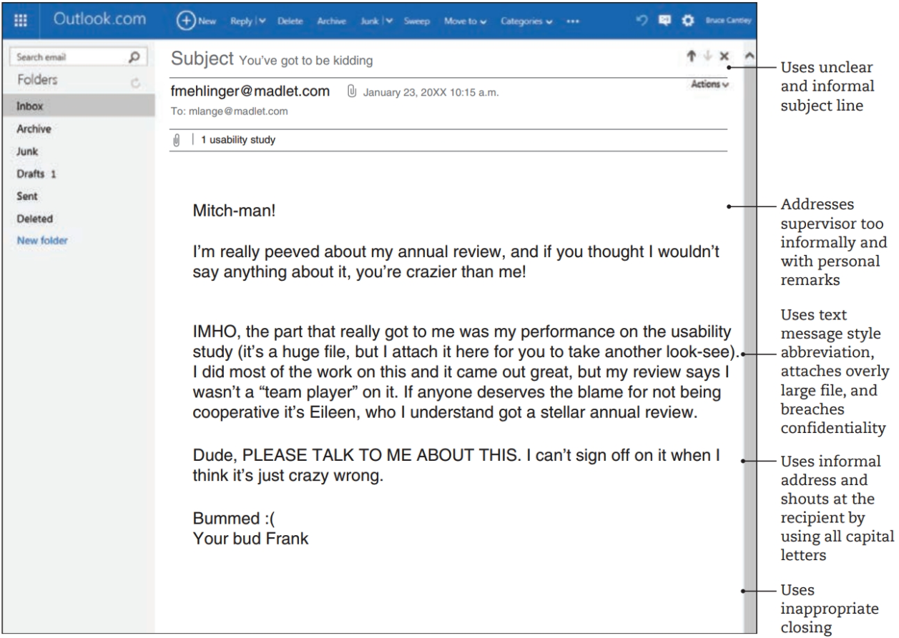

# Email

Workplace communication typically involves a combination of both print and digital media.

 **Reading Considerations**

- “Unlike paper documents, with email you have little control over the final audience” (352). How so? What are the implications of this and how you do account for them?
- Note standard email organization (353). Practicing convention is important to maintain credibility and professionalism. Poorly organized emails will quickly undermine your credibility and might mean your message will not be read (or taken seriously).
- “. . . do not forward a particularly sensitive email without permission, edit a forwarded email, or send enormous attachments” (353). Why? Think about examples of repercussions for doing any of the above.
- In general, how do the rules of netiquette described in this chapter apply to different places you have worked? To different discourse communities to which you belong?
- Focus on best practices and strategies for professional email, especially guidelines on how to write a subject line (which are similiar to MEMO subject lines and document titles).

## Workplace Email

Email is the primary way people communicate in today’s workplace and professional settings; it has all but replaced the paper memo and letter. Email offers both rapid speed and wide reach: With one keystroke, an email can quickly reach the inboxes of thousands of people.

Email can be used to communicate the main message or to provide a cover note, directing readers to a longer message in an attachment (typically Word or PDF). In either case, email is best suited for straightforward messages that are not too long and that do not leave a lot of room for misunderstanding.

### Audience and Purpose of Email

You do not have total control over the final audience. Remember this cardinal rule about email: Always assume your message will travel far beyond its intended recipient, and never send anything private or confidential via email.

Email accomplishes various purposes: to schedule meetings, update team members on a project, send simple memos in electronic form, and send attached documents to colleagues both within and outside of an organization.

Email can be used to communicate the main message or to provide a cover note, directing readers to a longer message in an attachment (typically Word or PDF).

Think carefully about whether email is the best medium for the given message. If you want your message to be private or confidential or if your message is too complex for email, set up a personal meeting or phone call.

### Components and Organization of Email

A typical email message combines features from both memos and letters. Emails usually begin with a heading, containing “To,” “From,” “Date,” and “Subject” fields. Most email programs also feature the courtesy copy (“cc”) and blind courtesy copy (“bec”) fields. Use “cc” for people who need to know but are not central to the conversation. Use “bcc” for a very long list of recipients or for individuals who need to be in the loop but may not want their email address visible. Attachments (such as PDF files or other documents too large or too formal for the email itself) take the place of the “enclosure” notation on a paper memo or letter. Depending on the level of formality, email may sometimes be written with openings and closings (“Dear John,” “Best, Linda”).

Regardless of length, an effective email should contain a brief introduction (even a single sentence) that gets right to the point, a clear body section with transitions (again, this section may be only a few sentences), and a brief conclusion that might ask readers to take action (such as “Please get back to me by 5:00 p.m. on Monday”). Visually, longer emails are easier for readers to process if information is broken into chunks, such as short paragraphs and bulleted lists. However, because email can be viewed on a range of screen sizes (computer, tablet, phone), keep email messages to about the size of one screen or less.

## Types of Workplace Emails

Email takes different shapes and forms, depending on where you work. A typical workplace email is show as: 

Do not use email to solve a complex situation, particularly an interpersonal one. 

Email is often used as a kind of cover memo to a longer attachment. The email itself contains three short paragraphs (introduction; body; conclusion), which serve to provide background, some details, and context for the consultant.

Another way email is used, particularly in large organizations, is as a formatted document that resembles company letterhead or other official communication. Unlike the examples discussed above, which are between two individuals, this type of email is sent from one part of the organization to all employees or to a large group of employees.The appearance signifies that the message is official and important. Figure 18.3 illustrates one such email; there is no attachment, rather, the email itself is formatted to look like a memo on letterhead. But because the message is digital, it contains links that readers can click on for more information. Typically, organizations will use the same visual format as a way to let readers know they should read the message. Formatting is clear, with plenty of white space, short paragraphs, and bulleted lists.

### Strategies for Choosing and Using Email {-}

- **Consider whether your message is for one person or for a large group.** Email between individuals is usually written within the email itself, but information for large groups (such as all employees, people who have signed up for a fitness plan, and so on) should be formatted in a way to make the message appear official. Doing so helps ensure that people will read the message.
- **Determine if the situation is too complicated for email.** Solving complicated interpersonal issues (Such as disagreements between team members) is not what email was designed to do. Use email in these cases to tone down the discussion and invite people to a meeting, conference call, or video chat, where employees can engage in real conversations and listen to each other.
- **Send attachments for long items or formal documents.** It’s tempting to just paste the entire contents of a long document directly into an email message, but readers won't appreciate this approach. Use attachments (in Word, if you are still working on the document or don’t care about precise page formatting, or in PDF if the document is complete and formatting needs to be retained). But don’t send too many attachments—it can be confusing for people to receive more than three attachments with any single email. For more than three documents, upload to a shared file server or the company intranet instead.
- **Consider confidentiality.** Email may not be the best medium for sending legal documents, confidential company files, or anything else that should remain private. Also, before forwarding a message, obtain permission from the sender, who may have intended the message for you only.
- **Assume your email is permanent and readable by anyone at any time.** Forensic software can find virtually any file that has been deleted, so don’t make promises you cannot keep or expect anything else you say to disappear forever.
- **Use appropriate formatting.** Provide a brief introduction, details in the body, and a conclusion. Use bullets, headings, numbered lists, italics, and other formatting features to make your message easy to read.
- **Keep it short.** Readers are impatient and don’t want to scroll through long screens of information. Messages longer than one screen will often go unread. If you must send a complex message, put longer details in an attachment.
- **End with a signature block.** If appropriate, include the name and address of your organization or department, your telephone and fax number, and other contact information by using an automatic signature block.

## Appropriate Style for Workplace Email

Email between friends and family (personal email) often contains deliberately misspelled or abbreviated words, a disregard for grammatical rules, a lax attitude toward proper punctuation, a highly informal tone, and an emphasis on brevity over completeness. Workplace email, however, should use proper spelling, grammar, and punctuation. Avoid using capital letters, and be careful with abbreviations (“LOL,” “imho,” and the like) and emojis. As noted in the previous examples, always use a professional, respectful tone. A workplace email that is too casual (e.g., using such words as “uh huh,” “whatever,” and “cool”) or is incomplete will undermine the writer’s professionalism and confuse readers.

Be sure to avoid flaming (angry, sarcastic, insulting messages that will only lead to repercussions). Don’t use biased language that demeans or excludes some potential readers. Do not use email for interpersonal issues, and avoid using it to blame others. Also, do not forward a particularly sensitive email without permission from the original writer, and do not edit an email to change the original meaning.

The word “netiquette” reflects the idea of Internet etiquette, the concept that online writers need to be especially careful and considerate of style, tone, feelings, and authority. Figure 18.4 shows an email lacking in professional style and overall online etiquette. Although the writer and recipient are close personal friends

in addition to their employee-supervisor relationship, an email like this should never be written in the workplace. Not only does the message have legal implications in terms of the writer’s job performance and future employment, but it also violates another employee’s confidentiality. It is also much too informal for any workplace document.

Remember that email does not disappear. Your message will be backed up and saved somewhere (usually on the organization’s backup system or the like) and may be brought up later in personnel or legal proceedings. Frank (the writer in Figure 18.4) did not stop to consider that his email is not just a one-time message, never to be seen again. His email could be used as part of an employment or disciplinary case later. Email may not seem permanent, but it is. Pressing “send” too quickly can be a problem down the road. Think before you type, and think again (and proofread, and wait a bit) before you send.

### Strategies for Email Style and Tone in the Workplace {-}

- **Consider your audience.** If you are writing to a customer, client, or superior in your organization, use a more formal tone than with a coworker or immediate supervisor. If you know your recipient well, use an informal salutation (“Hello”) and an informal closing (“Regards,” “Best”). However, for someone you don’t know or someone in authority, use a formal salutation (“Dear Dr. Gomez”) and a formal closing (“Sincerely”).
- **Consider your purpose. Don’t use email when a more personal medium is preferable.** Sometimes an issue is best resolved by talking face to face, making a phone call, or even just leaving a voice mail. Don’t use email to resign from a job, request a raise, respond to a formal letter, or respond to something that may have legal implications.
- **Write a clear subject line.** Instead of “Test Data” or “Data Request,” be specific: “Request for Beta Test Data for Project 18.” This line helps recipients decide whether to read the message immediately, and it helps for filing and future reference.
- **Use informal language, emojis, and abbreviations sparingly —if at all.** Even in an informal message, use proper spelling, grammar, and mechanics (avoid using only lowercase letters or all capital letters). Emojis should be avoided in workplace emails. The same goes for common abbreviations (FYI, ASAP, OMG), although technical abbreviations that are widely understood in your workplace are fine.
- **Proofread thoroughly before hitting “send.”** Every message reflects your image, so double-check any email with your name on it. Also, be careful that the email goes only to your intended recipients.
- **Be professional.** Take time to read email carefully; respond in a timely manner; avoid flaming (angry or personal attacks) and biased language; do not edit forwarded emails without the sender’s permission
- **Remember that there is a person on the other end of the message.** Email (and other forms of digital media) provide a shield, of sorts, between you and your reader(s). In a rush to finish up some work, or in a moment of feeling frustrated or even angry, you may write a message that makes you feel good but forgets the very real fact that a person, not a machine, will read your words. Try writing out your thoughts in a separate document, or write the email but save it in the “drafts” folder. Review it again in a few hours and revise, keeping your “reader as person” in mind.

## Copyright and Privacy in Digital Communication

Copyright is a system of legal protection for original works of authorship (books,photographs, user manuals, music) that are “fixed in a tangible medium.” In other words, copyright applies when an idea becomes recorded or written down or otherwise fixed, as in a printed book, an email message, a Web site, or a recorded piece of music.

In technical writing and communication, especially with digital communication,there are a few key aspects of copyright to be aware of. In the workplace, if you are a full-time employee, most of what you write and create is typically owned by the company. So be careful about posting material to a blog or Web site without first obtaining permission from the company. Also, you may find a photograph or piece of music or image on a Web site and think it’s the perfect visual for the report you are writing. But unless your use is for educational purposes or the piece is clearly marked as “copyright free” or “in the public domain,” you probably need to seek permission to use the item.

If you are unsure about the copyright status of a work, it’s best to consult with a librarian or with the author of the material, keeping in mind that sometimes the author is a corporate, not individual, author.

Digital communication also raises privacy issues. For example, avoid forwarding an email without checking with the sender first. Likewise, don’t forward proprietary information (information that originates in your company) to unauthorized recipients outside the company.
